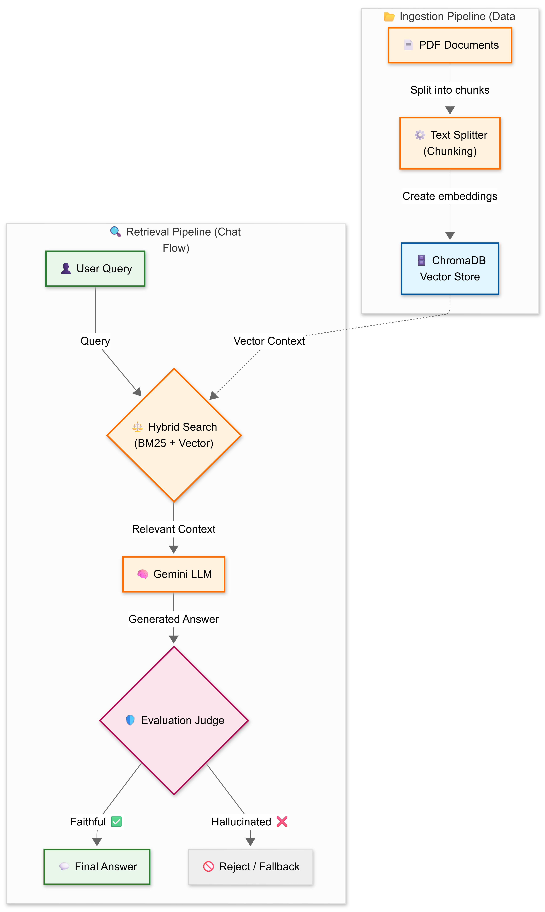

<div align="center">

# 🌍 AtlasRAG

### Enterprise-Grade RAG with Self-Correcting Intelligence


**AtlasRAG** is not just a chatbot — it's a self-correcting **Knowledge Intelligence System** that solves the biggest problem in enterprise GenAI: **Reliability.**

Every response is audited in real-time by an internal **LLM-as-a-Judge** evaluation engine that scores for **Faithfulness** (no hallucinations) and **Relevance** (actually useful answers) before it ever reaches the user.

[🚀 Get Started](#-installation--setup) · [📖 Documentation](#-usage-guide) · [🐛 Report Bug](https://github.com/R-Roy03/AtlasRAG/issues)

</div>

---

## ✨ Why AtlasRAG?

Most RAG systems **blindly trust** their LLM output. AtlasRAG doesn't.

| Feature | Standard RAG ❌ | AtlasRAG ✅ |
| :--- | :---: | :---: |
| **Search Type** | Vector Only | **Hybrid (Vector + BM25 Keyword)** |
| **Accuracy** | Prone to Hallucinations | **Self-Correcting with Evaluation Scores** |
| **Evaluation** | None (Blind Trust) | **LLM-as-a-Judge (Real-Time Audit)** |
| **Privacy** | Cloud Vector DB | **Local ChromaDB (Data Never Leaves)** |
| **Cost** | High (OpenAI GPT-4) | **Optimized (Gemini 2.5 Flash)** |
| **Dependencies** | Heavy SDK chains | **Lightweight Direct APIs** |

---

## 🚀 Key Features

### ⚖️ Self-Correcting Architecture
Every response is mathematically scored before being presented to the user.
- **Faithfulness Score** — Checks if the answer is grounded *strictly* in the retrieved documents.
- **Relevance Score** — Verifies if the answer actually addresses the user's query.

### 🔍 Hybrid Search Engine
Combines the best of both retrieval paradigms for maximum accuracy:
- **Vector Search (ChromaDB)** — Semantic understanding and conceptual matching.
- **Keyword Search (Rank-BM25)** — Exact matching of domain-specific jargon and technical terms.

### 🧠 Dynamic Knowledge Base
- **User-Controlled Chunking** — Adjust chunk sizes (500–2000 tokens) via the UI to optimize for precision or context.
- **Live Ingestion** — Upload PDF documents directly through the sidebar. The system handles chunking, embedding, and indexing in real-time.
- **In-Memory Processing** — Knowledge is indexed in RAM for blazing-fast retrieval.

### 💾 Smart Chat Management
- **Chat History** — Automatically saves your conversation context.
- **Export & Clear** — Download your full chat history as JSON or clear it with a single click.

---

## 🏗️ System Architecture

<div align="center">



</div>

> **Flow:** PDFs are ingested into a vector store → User queries trigger a **Hybrid Search** (Vector + BM25) → The LLM generates an answer → An **Evaluation Judge** audits the response for faithfulness and relevance → Only then is the answer shown to the user.

---

## 🛠️ Tech Stack

| Component | Technology | Why? |
| :--- | :--- | :--- |
| **LLM (Inference)** | Gemini 2.5 Flash | Latest high-speed model for reasoning & generation |
| **LLM (Judge)** | Gemini 2.5 Flash | Same high-tier model used for unbiased self-evaluation |
| **Embeddings** | all-MiniLM-L6-v2 | Fast, lightweight sentence embeddings |
| **Vector Store** | ChromaDB | Local, privacy-focused vector database |
| **Search Algorithm** | BM25 + Vector | Hybrid retrieval for maximum recall |
| **PDF Parsing** | pypdf | Robust PDF text extraction |
| **Frontend** | Streamlit | Interactive UI with real-time metric dashboards |

---

## ⚙️ Installation & Setup

### Prerequisites

- Python 3.10+
- A [Google AI Studio](https://aistudio.google.com/apikey) API key (free tier works)

### 1. Clone the Repository

```bash
git clone https://github.com/R-Roy03/AtlasRAG.git
cd AtlasRAG
```

### 2. Create a Virtual Environment

```bash
python -m venv venv

# Windows
venv\Scripts\activate

# macOS / Linux
source venv/bin/activate
```

### 3. Install Dependencies

```bash
pip install -r requirements.txt
```

### 4. Configure API Key

Create a `.env` file in the project root:

```env
GOOGLE_API_KEY="your_google_api_key_here"
```

### 5. Launch AtlasRAG

```bash
streamlit run app.py
```

The app will open in your browser at `http://localhost:8501` 🎉

---

## 📖 Usage Guide

1. **Launch** the application with `streamlit run app.py`.
2. **Upload PDFs** — Drag and drop your documents into the sidebar.
3. **Build Knowledge Base** — Click **"Update Knowledge Base"** to trigger chunking and embedding.
4. **Ask Questions** — Chat naturally. AtlasRAG retrieves context and generates grounded answers.
5. **Review Scores** — Every response includes **Faithfulness** and **Relevance** scores so you know you can trust it.

### 📝 Example

**Query:** *"Explain Kirchhoff's Current Law (KCL) with an example."*

**AtlasRAG Response:**
> "Kirchhoff's Current Law (KCL) states that the algebraic sum of the currents meeting at a junction in an electric circuit is equal to zero.
> **Example:** In a junction with entering currents I₁, I₃ and leaving currents I₂, I₄: I₁ + I₃ = I₂ + I₄."

| Metric | Score | Status |
| :--- | :---: | :---: |
| Faithfulness | 100% | ✅ Grounded in source documents |
| Relevance | 100% | ✅ Directly answers the query |

---

## 📂 Project Structure

```
AtlasRAG/
├── app.py                        # Main Streamlit application
├── .streamlit/config.toml        # Dark theme configuration
│
├── ingestion/                    # Document processing pipeline
│   ├── loader.py                 #   PDF loader (pypdf) + Document class
│   ├── chunker.py                #   Recursive text splitter
│   └── vector_store.py           #   ChromaDB in-memory indexer
│
├── retrieval/                    # Search & retrieval engines
│   ├── hybrid_search.py          #   Hybrid Vector + BM25 retriever
│   ├── vector_search.py          #   Standalone vector search
│   └── keyword_search.py         #   Standalone BM25 keyword search
│
├── inference/                    # LLM generation
│   └── generator.py              #   Gemini 2.5 Flash (REST API)
│
├── evaluation/                   # Quality assurance
│   └── metrics.py                #   LLM-as-a-Judge evaluator
│
├── assets/                       # Static assets
│   └── atlas_icon.svg            #   App icon
│
├── .github/workflows/
│   └── main.yml                  # CI/CD pipeline
│
├── test_retrieval.py             # Test suite
├── requirements.txt              # Dependencies
└── LICENSE                       # MIT License
```

---

## 🛡️ Stability & Future-Proofing

This project uses a **lightweight dependency stack** with direct API calls — no heavy SDK chains that break across versions. Simply run:

```bash
pip install -r requirements.txt
```

All dependencies will be restored to working versions.

---

## 📜 License

This project is licensed under the **MIT License** — see the [LICENSE](LICENSE) file for details.

---

<div align="center">

### 👤 Author

**Rakesh Raushan**

[](https://github.com/R-Roy03)

---

⭐ **If AtlasRAG helped you, consider giving it a star!** ⭐

*Built with 🖤 by Rakesh Raushan*

</div>